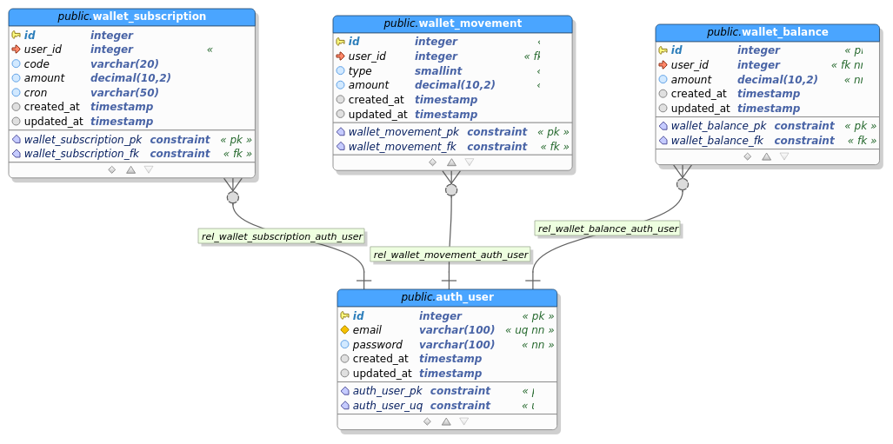

# API - Gestión de movimientos de entrada y salida de efectivo

> by Fredy Cortés :metal:

Se abarcan las siguientes **tecnologías**:

* Node.js
* TypeScript
* Express.js
* MySQL
* PostgreSQL

Se implementan los siguientes **patrones de diseño**:

* Inyección de dependencias - *awilix*
* Repositorios

Se implementa el **patrón arquitectónico**:

* N Capas

Se trabajaron las siguientes tablas en la base de datos:

### wallet_subscription

|Field|Type|Null|Key|Default|Extra|
|-|-|-|-|-|-|
|id|int|NO|PRIMARY|NULL|auto_increment|
|user_id|int|NO||NULL||
|code|varchar(20)|NO||NULL||
|amount|decimal(10,2)|NO||NULL||
|cron|varchar(50)|NO||NULL||
|created_at|datetime|YES||NULL||
|updated_at|datetime|YES||NULL||

### wallet_balance

|Field|Type|Null|Key|Default|Extra|
|-|-|-|-|-|-|
|id|int|NO|PRIMARY|NULL|auto_increment|
|user_id|int|NO||NULL||
|amount|decimal(10,2)|NO||NULL||
|created_at|datetime|YES||NULL||
|updated_at|datetime|YES||NULL||

### wallet_movement

|Field|Type|Null|Key|Default|Extra|
|-|-|-|-|-|-|
|id|int|NO|PRIMARY|NULL|auto_increment|
|user_id|int|NO||NULL||
|type|tinyint|NO||NULL||
|amount|decimal(10,2)|NO||NULL||
|created_at|datetime|YES||NULL||
|updated_at|datetime|YES||NULL||

### auth_user

|Field|Type|Null|Key|Default|Extra|
|-|-|-|-|-|-|
|id|int|NO|PRIMARY|NULL|auto_increment|
|email|varchar(100)|NO||NULL||
|password|varchar(100)|NO||NULL||
|created_at|datetime|YES||NULL||
|updated_at|datetime|YES||NULL||

A continuación se muestra el modelo relacional hecho en ***pgmodeler***:

